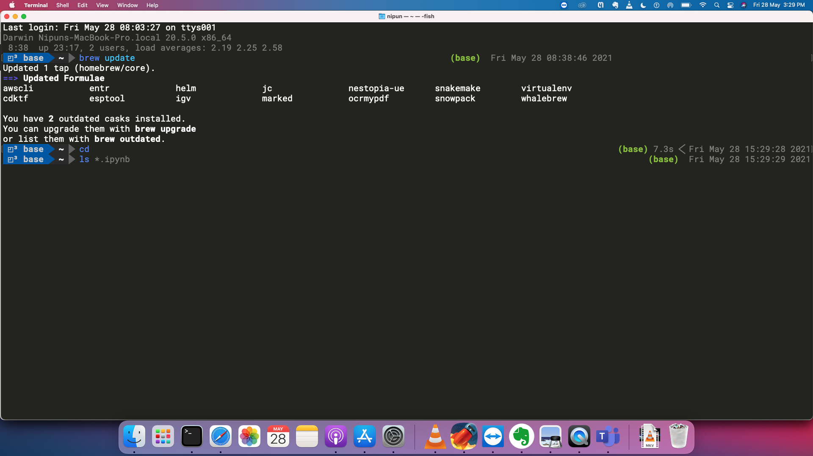

# Setting up a new Mac

Here is a screenshot.




I will now discuss how I setup a new Mac. I use homebrew. It makes it very easy to maintain all the packages up to date. 


### Install homebrew and some pertinent packages

`/bin/bash -c "$(curl -fsSL https://raw.githubusercontent.com/Homebrew/install/master/install.sh)"`

Install fish shell

`brew install fish`

Make fish default

```
sudo bash -c 'echo /usr/local/bin/fish >> /etc/shells'
chsh -s /usr/local/bin/fish
```


Install git

`brew install git`

Install powerline fonts

```
git clone https://github.com/powerline/fonts
cd fonts
./install.sh
```

Use powerline fonts in shell

Go to Terminal -> Preferences
Change font to powerline
I am using Roboto Mono Light Powerline 18pt


git clone git://github.com/stephenway/monokai.terminal.git
open monokai.terminal
(set this theme as default)

Install fish theme

`omf install bobthefish`

Install Zoom

`brew install --cask zoom`

Install Firefox

`brew install --cask firefox`


Install VSCode

`brew install --cask visual-studio-code`

Install OBSStudio

`brew install --cask obs`

VLC

`brew install --cask vlc`

wget

`brew install wget`

anaconda

`brew install --cask anaconda`

anaconda path setup in fish

`./usr/local/anaconda3/condabin/conda init fish`

Install MacTex (slow!)

`brew install --cask mactex`

Installing TexStudio
`brew install --cask texstudio`

FFMPeg
`brew install ffmpeg`

Imagemagick
`brew install imagemagick`

Ghostscript
`brew install ghostscript`


Install pandoc

`brew install pandoc`
 
 
### Viewing installed packages
 
`brew leaves > brew.txt`
 
The content of brew.txt is:

```
boost
cmake
ffmpeg
fish
git
graphviz
ilmbase
imagemagick
pandoc
r
rtmpdump
swig
vim
wget
```
 
`brew list --cask > casks.txt`
 
The content of casks.txt is:
 
```
anaconda
anydesk
arduino
audacity
firefox
google-chrome
inkscape
keycastr
mactex
notion
obs
pdf-expert
pycharm
rstudio
simplenote
texstudio
visual-studio-code
vlc
zoom
```


 
 
 
